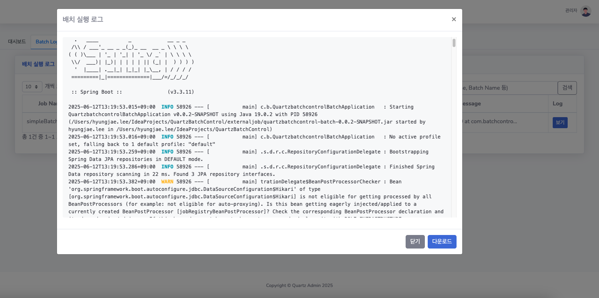
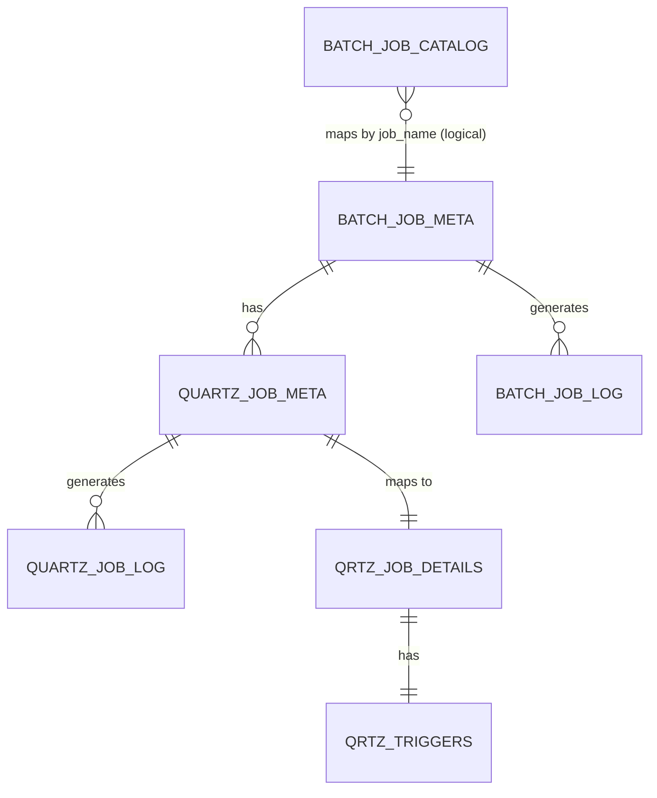
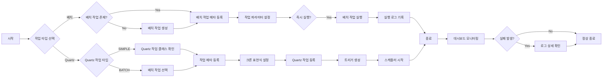

# QuartzBatchControl

Spring Batch와 Quartz Scheduler를 통합 관리하는 웹 기반 배치 작업 관리 시스템


---

## 소개

**QuartzBatchControl**은 Spring Batch와 Quartz Scheduler를 통합하여  
운영자가 스케줄 기반 혹은 수동으로 배치잡을 관리해야 하는 상황에서,
웹 UI로 편리하게 작업을 수행하고 실행 이력을 확인할 수 있도록 설계된 **실시간 통합 배치 관리 시스템**입니다.
운영 효율성을 높이고, 로그와 상태 추적을 구조화함으로써 배치 운영의 안정성과 가시성을 제공합니다.  
### 참고: 본 프로젝트는 코드 제공을 목적으로 하며, 실제 운영 환경에서는 각 조직의 CI/CD 환경, 다중 서버 구조, **로그 저장 방식(S3 등)**에 맞게 구성 및 확장하여 사용해야 합니다.

---

## Release

### 2.0.0 (최신) : 배치 프로젝트(quartzbatchcontrol-batch)는 메인 백엔드와 완전히 분리되어 외부 JAR 실행 구조로 변경되었습니다.
- **아키텍처 분리**: 기존 백엔드(Spring Boot) 프로젝트에서 스프링 배치 코드를 완전히 분리하여, 별도의 `quartzbatchcontrol-batch` 프로젝트로 관리
- **외부 배치 실행**: 백엔드에서는 커맨드라인을 통해 외부 배치 JAR을 실행하는 구조로 변경
- **배치 JAR 관리**: 배치 프로젝트는 jar로 빌드하여 특정 경로에 위치시키고, 백엔드에서 설정파일의 경로를 변경 (설정된 디렉토리 변경 필요)
```bash
# 외부 배치 프로젝트 빌드
# GitHub Actions 기준: JAR 빌드 및 EC2 배포, 최신 심볼릭 링크 갱신
- name: Build batch jar
  run: |
    cd quartzbatchcontrol-batch
    ./gradlew clean bootJar

- name: Copy jar to EC2
  uses: appleboy/scp-action@v0.1.4
  with:
    host: ${{ secrets.EC2_HOST }}
    username: ec2-user
    key: ${{ secrets.EC2_SSH_KEY }}
    source: "quartzbatchcontrol-batch/build/libs/*.jar"
    target: "/home/ec2-user/externaljob"

- name: Update latest symlink
  uses: appleboy/ssh-action@v0.1.10
  with:
    script: |
      cd /home/ec2-user/externaljob
      ln -sf $(ls -t *.jar | head -n 1) latest
```
- **로그 관리 강화**: 배치 프로젝트에 로그 관리를 위한 리스너(BatchJobExecutionListener)가 기본 설정되어 있어, 배치 실행 시 로그가 자동으로 관리됨 (다중서버일 경우 외부 저장소 필요)
- **확장성**: 새로운 배치 잡은 `quartzbatchcontrol-batch` 프로젝트에 생성하고 BatchJobExecutionListener 추가

### 1.0.0
- **내장형 배치**: 쿼츠배치 백엔드(Spring Boot) 프로젝트 내에서 가벼운 스프링 배치 잡을 직접 구현
- **직접 실행**: 백엔드 프로젝트에 등록된 배치 잡을 직접 수행하는 구조
- **단일 프로젝트**: 배치와 스케줄러가 한 프로젝트 내에 통합되어 있음

---

## 주요 기능

- **대시보드**: 배치/Quartz 작업 현황 및 성공/실패 통계 시각화
- **배치 관리**: 배치 작업 등록, 수정, 즉시 실행, 파라미터 관리
- **배치 로그**: 실행 이력, 파라미터, 상태, 상세 로그 확인
- **Quartz 관리**: Quartz 작업 등록, 수정, 스케줄 관리, 상태 변경(일시정지/재개/삭제)
- **Quartz 로그**: Quartz 작업 실행 이력 및 상세 로그 확인
- **검색/필터**: 다양한 조건으로 작업 및 로그 검색
- **실시간 모니터링**: 작업 상태 및 결과를 실시간으로 확인

---

## 빠른 시작

### 요구사항
- JDK 17 이상
- Node.js 16 이상
- MySQL 8.0 이상

### 설치 및 실행
1. Backend 서버를 먼저 실행
2. Frontend 실행 (http://localhost:Port)
3. 외부 배치 JAR은 별도 실행 필요 시 수행

#### Batch (2.0.0 Release)
```bash
git clone [repository-url]
cd quartzBatchControl-batch
./gradlew build
java -jar quartzbatchcontrol-batch-0.0.1-SNAPSHOT.jar --spring.profiles.active=sync-only  (등록된 배치잡 목록을 DB 등록)
```

#### Backend
```bash
git clone [repository-url]
cd QuartzBatchControl-Backend
./gradlew build
./gradlew bootRun
```

#### Frontend
```bash
cd quartzbatchcontrol-frontend
npm install
npm run dev
```

---

## 스크린샷

### 대시보드


### 배치 관리


### 배치 로그

### 배치 상세 로그 (2.0.0 Release)


### Quartz 관리


### Quartz 로그


---

## 기술 스택

- **Backend**: Spring Boot, Spring Batch, Quartz Scheduler, Spring Security, Spring Data JPA, QueryDSL, MySQL
- **Frontend**: Vue.js 3, Bootstrap Admin 2, Axios, Pinia, Vite
- **기타**: Swagger(OpenAPI), ESLint, Prettier

---

## 폴더 구조

```text
QuartzBatchControl/
├── batch-logs/                   # quartzBatchControl-batch 로그폴더
├── externaljob                   # quartzBatchControl-batch Jar 폴더
│   ├── latest                    # 최신 quartzBatchControl-batch.jar 의 심볼릭링크
├── QuartzBatchControl-Backend/   # Spring Boot 백엔드
├── quartzBatchControl-batch/     # Batch 백엔드 (2.0.0 Release)
├── quartzbatchcontrol-frontend/  # Vue.js 프론트엔드
│   ├── src/
│   │   ├── components/
│   │   ├── api/
│   │   └── ...
│   ├── public/
│   └── ...
└── docs/
```

---

## 시스템 아키텍처
### 데이터베이스 구조




### 통합 작업 관리 플로우




### 테이블 관계
1. **BatchJobMeta (배치 작업 메타데이터)**
  - 배치 작업의 기본 정보 관리
  - 작업 파라미터 저장
  - QuartzJobMeta와 1:N 관계

2. **QuartzJobMeta (Quartz 작업 메타데이터)**
  - Quartz 작업의 기본 정보 관리
  - BatchJobMeta와 N:1 관계
  - 작업 타입 (SIMPLE/BATCH) 구분
  - QRTZ_JOB_DETAILS와 1:1 관계

3. **BatchJobLog (배치 작업 로그)**
  - 배치 작업 실행 이력
  - BatchJobMeta와 N:1 관계

4. **QuartzJobLog (Quartz 작업 로그)**
  - Quartz 작업 실행 이력
  - QuartzJobMeta와 N:1 관계

5. **QRTZ_JOB_DETAILS (Quartz 작업 상세)**
  - Quartz 작업 상세 정보
  - QRTZ_TRIGGERS와 1:1 관계
  - QuartzJobMeta와 1:1 관계

---

## API 문서

- Swagger(OpenAPI) 제공  
  백엔드 서버 실행 후 [http://localhost:8080/swagger-ui.html](http://localhost:8080/swagger-ui.html) 접속

### 주요 엔드포인트 예시

- `/api/dashboard` : 대시보드 통계
- `/api/batch` : 배치 작업 관리
- `/api/batch-log` : 배치 로그
- `/api/quartz-jobs` : Quartz 작업 관리
- `/api/quartz-log` : Quartz 로그
- `/api/auth` : 인증/회원가입

---
