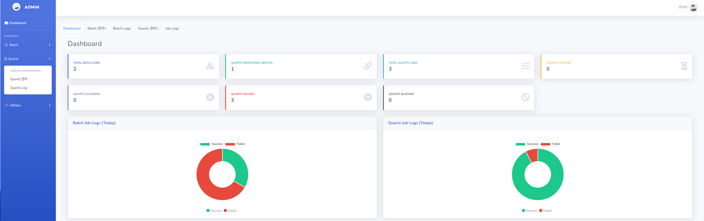

# QuartzBatchControl

## 프로젝트 소개
QuartzBatchControl은 Spring Batch와 Quartz Scheduler를 통합하여 관리하는 웹 기반 배치 작업 관리 시스템입니다. 
배치 작업의 등록, 수정, 실행 및 모니터링을 제공하며, Quartz Scheduler를 통해 일반 작업과 배치 작업의 스케줄링을 관리합니다.

## 화면 구성
### 대시보드


- 작업 현황 카드
  - 배치 작업 통계
  - Quartz 작업 통계
- 실행 결과 차트
  - 당일 배치 작업 성공/실패 비율
  - 당일 Quartz 작업 성공/실패 비율

### 배치 관리


- 작업 목록 테이블
  - 검색 필터
  - 작업 등록/수정/실행 버튼


- 작업 등록/수정 폼
  - 작업 선택 (batch.job 패키지 기반)
  - 파라미터 관리

### 배치 로그


- 로그 목록 테이블
  - 검색 필터
  - 상세 정보 조회

### Quartz 관리


- 작업 목록 테이블
  - 검색 필터
  - 작업 등록/수정/실행/일시정지/재개/삭제 버튼


- 작업 등록/수정 폼
  - 작업 타입 선택
  - 작업/배치 작업 선택
  - 크론 표현식 설정

### Quartz 로그


- 로그 목록 테이블
  - 검색 필터
  - 상세 정보 조회

## 주요 기능
### 대시보드
- 등록된 Spring Batch 작업 현황
  - 전체 배치 작업 수
  - Quartz와 연동된 배치 작업 수
  - Quartz 작업 전체 수
  - 작업 상태별 현황
- 당일 작업 실행 결과 통계
  - 배치 작업 성공/실패 현황 (파이 차트)
  - Quartz 작업 성공/실패 현황 (파이 차트)

### 배치 관리
- 배치 작업 검색
- 배치 작업 등록
  - batch.job 패키지의 기존 배치 작업 기반 등록
  - 작업 메타데이터 관리
- 배치 작업 수정
  - 작업 파라미터 관리 (추가/삭제/변경)
- 배치 작업 즉시 실행
  - 저장된 작업 파라미터 기반 실행

### 배치 로그
- 작업 실행 이력 조회
  - 성공/실패 상태
  - 실행 파라미터
  - 실행자 정보
  - 시작/종료 시간

### Quartz 관리
- Quartz 작업 검색
- Quartz 작업 등록
  - SIMPLE 타입: quartz.job 패키지의 작업 기반 등록
  - BATCH 타입: batch_job_meta의 작업 선택하여 등록
- 작업 상태 관리
  - 즉시 실행
  - 일시 정지
  - 재개
  - 삭제
- 작업 수정
  - 크론 표현식 변경

### Quartz 로그
- 작업 실행 이력 조회
  - 작업 이름
  - 작업 그룹
  - 작업 타입
  - 실행 결과

## 기술 스택
### Backend
- Spring Boot
- Spring Batch
- Quartz Scheduler
- Spring Security
- Spring Data JPA
- QueryDSL
- MySQL

### Frontend
- Vue.js
- Bootstrap Admin 2
- Axios
- Vuex

## 시스템 아키텍처
### 데이터베이스 구조


### 통합 작업 관리 플로우


### 테이블 관계
1. **BatchJobMeta (배치 작업 메타데이터)**
   - 배치 작업의 기본 정보 관리
   - 작업 파라미터 저장
   - QuartzJobMeta와 1:N 관계

2. **QuartzJobMeta (Quartz 작업 메타데이터)**
   - Quartz 작업의 기본 정보 관리
   - BatchJobMeta와 N:1 관계
   - 작업 타입 (SIMPLE/BATCH) 구분
   - QRTZ_JOB_DETAILS와 1:1 관계

3. **BatchJobLog (배치 작업 로그)**
   - 배치 작업 실행 이력
   - BatchJobMeta와 N:1 관계

4. **QuartzJobLog (Quartz 작업 로그)**
   - Quartz 작업 실행 이력
   - QuartzJobMeta와 N:1 관계

5. **QRTZ_JOB_DETAILS (Quartz 작업 상세)**
   - Quartz 작업 상세 정보
   - QRTZ_TRIGGERS와 1:1 관계
   - QuartzJobMeta와 1:1 관계


## API 문서
Springdoc OpenAPI (Swagger)를 통해 API 문서를 확인할 수 있습니다. 애플리케이션 실행 후, 웹 브라우저에서 `/swagger-ui.html` 경로로 접속하세요.

### 대시보드 API (`/api/dashboard`)
- GET `/batchCount` - Batch Job 통계 조회
- GET `/batchLogCount` - Batch Log 통계 조회
- GET `/quartzCount` - Quartz 작업 통계 조회
- GET `/quartzLogCount` - Quartz 로그 통계 조회

### 배치 작업 API (`/api/batch`)
- GET `/` - 배치 Job 메타데이터 목록 조회 (페이지네이션)
- GET `/{metaId}` - 배치 Job 상세 조회
- GET `/available` - 사용 가능한 배치 Job 목록 조회
- GET `/all` - 모든 배치 Job 메TA데이터 조회 (리스트)
- POST `/` - 배치 Job 등록
- PUT `/` - 배치 Job 수정
- POST `/execute/{metaId}` - 배치 Job 실행

### 배치 로그 API (`/api/batch-log`)
- GET `/` - 배치 Log 목록 조회

### Quartz 작업 API (`/api/quartz-jobs`)
- GET `/` - Quartz Job 메타데이터 목록 조회 (페이지네이션)
- GET `/preview-schedule` - CRON 표현식 다음 실행 시간 미리보기
- POST `/` - Quartz Job 생성
- POST `/update` - Quartz Job 수정
- GET `/delete/{metaId}` - Quartz Job 삭제
- GET `/pause/{metaId}` - Quartz Job 일시정지
- GET `/resume/{metaId}` - Quartz Job 재개
- GET `/trigger/{metaId}` - Quartz Job 즉시 실행

### Quartz 로그 API (`/api/quartz-log`)
- GET `/` - Quartz Log 목록 조회

### 사용자 인증 API (`/api/auth`)
- POST `/signup` - 회원가입
- POST `/login` - 로그인

## 설치 및 실행
### 요구사항
- JDK 17 이상
- Node.js 16 이상
- MySQL 8.0 이상

### Backend 설정
```bash
# 프로젝트 클론
git clone [repository-url]

# 디렉토리 이동
cd QuartzBatchControl-Backend

# 의존성 설치
./gradlew build

# 애플리케이션 실행
./gradlew bootRun
```

### Frontend 설정
```bash
# 디렉토리 이동
cd quartzbatchcontrol-frontend

# 의존성 설치
npm install

# 개발 서버 실행
npm run serve

# 프로덕션 빌드
npm run build
```
